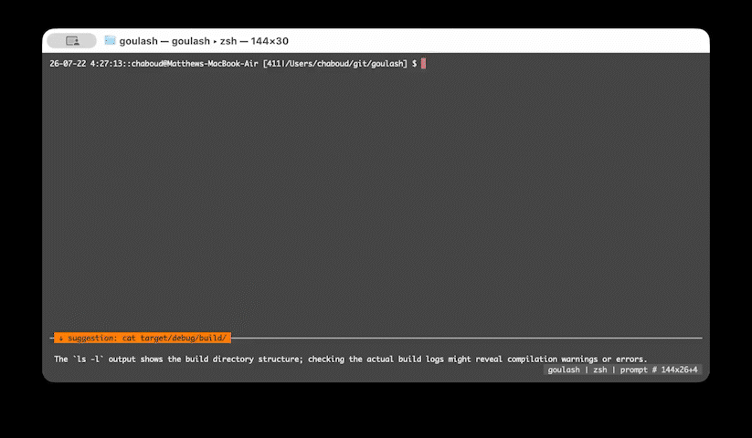

# goulash - a plain-language navigator for your shell

Just Down-arrow for your *future* history.

## Why?
*(If you are a terminal graybeard who hand-regexed raw curl to read this page, you can stop now and go back to being immortal.  For the rest of us...)*

We don't always remember the syntax for all terminal commands, and we shouldn't have to.  When we try to string together operations, there's a familiar loop:

Start typing command → forget *esoteric syntax* → go to Google/ChatGPT/Claude to ask → notice email/slack/Hacker-News → read a few papers/links/threads → get lunch → come back to prompt confused about what was happening in this terminal → re-understand the situation → start typing command → ...

Context switching has a cost.  Going to a browser or an agent breaks working flow.

But large language models (LLMs) are pretty good at *esoteric syntax*, even *small* large language models... brainwave! ka-ching! (note: this software is free.)

## What?
Goulash is an LLM-aware overlay for the shell you already use. It watches the session and offers advice and executable suggestions *in your terminal*, but every keystroke and every command is still yours.  Goulash doesn't run commands, pop up choices, or take over how you work.  It's your terminal... with a navigator.

<p align="center">
  
</p>

## Install
```sh
# You need an engine for processing.  Ollama with gemma4:e4b works well, for example  

cargo install goulash # from crates.io

# or, with Homebrew
brew tap chaboud/goulash https://github.com/chaboud/goulash
brew install goulash
```

## Usage
Run `goulash` and use your shell exactly as before. Goulash provides suggestions *below* your prompt; your *future history*.  Just press the down arrow if you see something you like.

### `#` ask a question, get an answer + a pullable command
Type `#` and a question at your prompt (it's a shell comment recorded in history, never executed).

The LLM will provide a suggested command. Press down (past the end of shell history) and it lands on your prompt for editing.  Enter runs it as your own command. 
Goulash also reviews your shell use as you go and may leave a tip in the same spot.  Use a local model, and it's all private, all local, just like your terminal command history.

### Style - Arrows: one spatial axis

Shell history lives above your prompt; goulash's suggestions live below. Up and Down just move along the line:

```text
   ↑  zsh history (as always)
── your empty prompt ──────────────── neutral
   ↓  newest suggested command       ( ↓ again: older · ↑: back up )
```

Down past the newest keeps going into the **history of suggested commands** with the position (`↑ 3/7 ↓`) shown at the right of the rule. Up retraces to your empty prompt, and past that it's plain zsh/bash history.

### `##` longer chat
`##` (or `## question`) flips into a chat panel; follow-ups need no prefix. The shell keeps running above.  When you select a command to copy to the prompt, you're back in your shell.

### `#/` goulash's menu controls
```text
#/model            modal model picker: type to filter, ⏎ selects & saves
#/model NAME       try a model for this session (add `save` to persist)
#/memory on        give the model a small pinned memory (REMEMBER/FORGET)
#/memory           browse the slots: filter, ↑↓, ⏎⏎ to forget one
#/thinking low     reasoning level: off | low | medium | high
#/commentary off   quiet the per-turn heckling
#/status
#/help
```

## Nerd Stuff: Build & modify
```
cargo build
./target/debug/goulash            # wraps $SHELL
./target/debug/goulash zsh        # or name a shell
```

**Shell integration is automatic** for zsh and bash launched with plain flags — goulash injects its hooks (ZDOTDIR trick / `--rcfile` wrapper) on top of your normal rc files, no editing required. That's what powers command blocks, `#` asides, and the plain-Down suggestion pull.

Manual fallback (custom shells or `auto_integrate = false`):

```sh
# ~/.zshrc
[[ -n "$GOULASH" ]] && source /path/to/goulash/shell/goulash.zsh
# ~/.bashrc
[[ -n "$GOULASH" ]] && source /path/to/goulash/shell/goulash.bash
```

Config (optional): `~/.goulash/config.toml`

```toml
[status]
enabled = true
rows = 1
```

Tests (drives the binary under a real PTY):

```
cargo build && python3 tests/e2e.py
```

## License
Dual-licensed under [MIT](LICENSE-MIT) or [Apache-2.0](LICENSE-APACHE), at your option. Unless you explicitly state otherwise, any contribution intentionally submitted for inclusion in goulash by you, as defined in the Apache-2.0 license, shall be dual licensed as above, without any additional terms or conditions.
