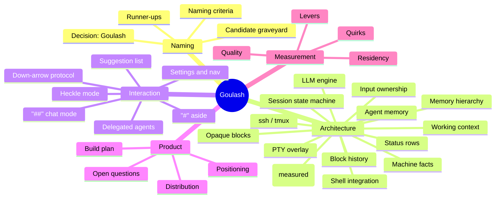

# Goulash Wiki — Map of Content

**Goulash** — *Generic Overlay for Universal LLM-Augmented SHells* — is an
LLM-aware veneer that wraps the shell you already use, watches the
session, and offers advice and executable suggestions while leaving
control with the user.

> Your shell, with a coach.

**Status: shipping, 0.4.0.** zsh and bash are supported; **fish is not
yet** — it is an adapter in the [Later](product/build-plan.md) pile, so
treat "universal" as the ambition in the acronym rather than a claim
about today. The engine speaks ollama and any OpenAI-compatible server
(LM Studio, llama.cpp).

This wiki is a mind-map: many small, densely-linked pages, written to be
useful to both humans and LLMs ingesting the repo. Start anywhere; every
page links back out. Conventions are in [meta/wiki-conventions.md](meta/wiki-conventions.md).

Pages here fall into two kinds, and it matters which you are reading:
**design** pages reason about what to build, **measurement** pages report
what a run actually did. Where they conflict, see
[Where the evidence lives](#where-the-evidence-lives) below.

## Mind map

## Where the evidence lives

Design pages argue; [`bench/`](../bench/) measures. The engine's
defaults come from ~5,500 generations across 24 model cells and two
engines, and every settled lever links back to the run that decided it:

- [`bench/QUALITY.md`](../bench/QUALITY.md) — blind-graded answer quality
- [`bench/QUIRKS.md`](../bench/QUIRKS.md) — do models need per-model adapters
- [`bench/RESIDENCY.md`](../bench/RESIDENCY.md) — load cost, memory, keep-alive
- [`bench/THINKING.md`](../bench/THINKING.md) — what reasoning costs and buys
- [`bench/HEADROOM.md`](../bench/HEADROOM.md) — context growth and cache behaviour

When a page here and a page there disagree, **the bench wins** — and the
design page should be corrected with a dated note rather than silently
edited.

## Clusters

### Naming
- [naming/decision.md](naming/decision.md) — current shortlist (goulash / flsh / lavash), the ballot, working name
- [naming/goulash.md](naming/goulash.md) — expansion, collisions, brand assessment
- [naming/runner-ups.md](naming/runner-ups.md) — CoaSH, Lavash, FLESH, Yesh, Gesh, and the food shortlist
- [naming/candidate-graveyard.md](naming/candidate-graveyard.md) — every name that died, and what killed it
- [naming/criteria.md](naming/criteria.md) — what we learned about naming a shell in 2026

### Architecture
- [architecture/overview.md](architecture/overview.md) — the whole system in one page
- [architecture/pty-overlay.md](architecture/pty-overlay.md) — `goulash $SHELL`: PTY master/slave wrapper
- [architecture/input-ownership.md](architecture/input-ownership.md) — who owns the Down arrow: the three gates
- [architecture/session-state-machine.md](architecture/session-state-machine.md) — PROMPT / COMMAND / INTERACTIVE_CHILD
- [architecture/shell-integration.md](architecture/shell-integration.md) — zsh ZLE, bash Readline, fish, generic fallback
- [architecture/block-history.md](architecture/block-history.md) — the block-oriented transcript model
- [architecture/memory-hierarchy.md](architecture/memory-hierarchy.md) — raw leaves, LLM-set region markers, logarithmic ramp-off retrieval
- [architecture/llm-engine.md](architecture/llm-engine.md) — provider probe chain, local-first caching, watcher/thinker tiers
- [architecture/two-lane-engagement.md](architecture/two-lane-engagement.md) — `#` answers fast and slow amends underneath it; `#?` goes straight to slow
- [architecture/model-capabilities.md](architecture/model-capabilities.md) — thinking is not one dial: each model's own dialect
- [architecture/ambient-research.md](architecture/ambient-research.md) — the hierarchy as throttle
- [architecture/levers.md](architecture/levers.md) — **every engine setting, with the measurement that chose its default**
- [architecture/machine-facts.md](architecture/machine-facts.md) — what goulash tells the model about the box it runs on (`engine.divulge`)
- [architecture/suggestion-vendors.md](architecture/suggestion-vendors.md) — rules (thefuck-style), history/n-gram, LLM vendors behind one interface
- [architecture/agent-memory.md](architecture/agent-memory.md) — remember-as-a-tool: prime store + searchable bank (backlog)
- [architecture/working-context.md](architecture/working-context.md) — `#@` pinned files as near-tool-use: async ingest, LLM compression (design)
- [architecture/status-rows.md](architecture/status-rows.md) — reserved bottom rows via shrunken inner PTY
- [architecture/implementation.md](architecture/implementation.md) — Rust, crate landscape, `~/.goulash/` config
- [architecture/opaque-blocks.md](architecture/opaque-blocks.md) — TUIs as opaque blocks; echo-off secret hygiene
- [architecture/remote-and-multiplexers.md](architecture/remote-and-multiplexers.md) — ssh and tmux boundaries

### Interaction
- [interaction/model.md](interaction/model.md) — the `#`/`##` escalation ladder and the prompt as interaction point
- [interaction/suggestion-list.md](interaction/suggestion-list.md) — async vended, insert-at-top, freeze-on-focus, staleness
- [interaction/down-arrow-protocol.md](interaction/down-arrow-protocol.md) — `goulash-down-or-suggest`
- [interaction/chat-mode.md](interaction/chat-mode.md) — `##`: chat with tools, top third stays shell, autonomy dial
- [interaction/delegated-agents.md](interaction/delegated-agents.md) — `# go recon this folder`, sub-tabs, scouts and stewards
- [interaction/settings-and-nav.md](interaction/settings-and-nav.md) — TV-remote spatial nav, `#/` commands with args, config write-back
- [interaction/heckle-mode.md](interaction/heckle-mode.md) — MST3K commentary band: explanations above the status row, collapsible

### Product
- [product/positioning.md](product/positioning.md) — coach, not agent overlord
- [product/build-plan.md](product/build-plan.md) — from wiki to working binary: milestones and the live backlog
- [product/distribution.md](product/distribution.md) — license, crates.io, tap, notarization: the road to `brew install goulash`
- [product/open-questions.md](product/open-questions.md) — unresolved design questions
- [product/state-of-play.md](product/state-of-play.md) — where things actually stand, written to be handed over

### Meta
- [meta/care.md](meta/care.md) — why this program needs unusual thoroughness, and what that demands of a change
- [meta/wiki-conventions.md](meta/wiki-conventions.md) — how this wiki is organized
- [meta/provenance.md](meta/provenance.md) — where this thinking came from
