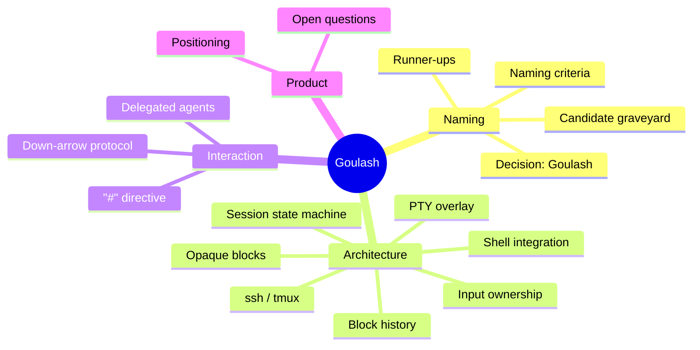

# Goulash Wiki — Map of Content

**Goulash** — *Generic Overlay for Universal LLM-Augmented SHells* — is an
LLM-aware veneer that wraps the shell you already use (bash, zsh, fish, …),
watches the session, and offers advice and executable suggestions while
leaving control with the user.

> Your shell, with a coach.

This wiki is a mind-map: many small, densely-linked pages, written to be
useful to both humans and LLMs ingesting the repo. Start anywhere; every
page links back out. Conventions are in [meta/wiki-conventions.md](meta/wiki-conventions.md).

## Mind map

## Clusters

### Naming
- [naming/decision.md](naming/decision.md) — current shortlist (goulash / flsh / lavash), the ballot, working name
- [naming/goulash.md](naming/goulash.md) — expansion, collisions, brand assessment
- [naming/runner-ups.md](naming/runner-ups.md) — CoaSH, Lavash, FLESH, Yesh, Gesh, and the food shortlist
- [naming/candidate-graveyard.md](naming/candidate-graveyard.md) — every name that died, and what killed it
- [naming/criteria.md](naming/criteria.md) — what we learned about naming a shell in 2026

### Architecture
- [architecture/overview.md](architecture/overview.md) — the whole system in one page
- [architecture/pty-overlay.md](architecture/pty-overlay.md) — `goulash $SHELL`: PTY master/slave wrapper
- [architecture/input-ownership.md](architecture/input-ownership.md) — who owns the Down arrow: the three gates
- [architecture/session-state-machine.md](architecture/session-state-machine.md) — PROMPT / COMMAND / INTERACTIVE_CHILD
- [architecture/shell-integration.md](architecture/shell-integration.md) — zsh ZLE, bash Readline, fish, generic fallback
- [architecture/block-history.md](architecture/block-history.md) — the block-oriented transcript model
- [architecture/opaque-blocks.md](architecture/opaque-blocks.md) — TUIs as opaque blocks; echo-off secret hygiene
- [architecture/remote-and-multiplexers.md](architecture/remote-and-multiplexers.md) — ssh and tmux boundaries

### Interaction
- [interaction/model.md](interaction/model.md) — the `#` aside, suggestions, and the user's control
- [interaction/down-arrow-protocol.md](interaction/down-arrow-protocol.md) — `goulash-down-or-suggest`
- [interaction/delegated-agents.md](interaction/delegated-agents.md) — `# go recon this folder`, sub-tabs, scouts and stewards

### Product
- [product/positioning.md](product/positioning.md) — coach, not agent overlord
- [product/build-plan.md](product/build-plan.md) — from wiki to working binary: MVP milestones
- [product/open-questions.md](product/open-questions.md) — unresolved design questions

### Meta
- [meta/wiki-conventions.md](meta/wiki-conventions.md) — how this wiki is organized
- [meta/provenance.md](meta/provenance.md) — where this thinking came from
